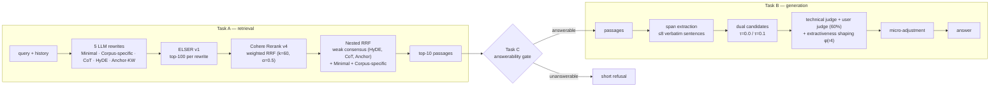

# AILS-NTUA at SemEval-2026 Task 8: MTRAGEval

[](https://arxiv.org/abs/2603.10524)
[](https://semeval.github.io/SemEval2026/)
[](LICENSE)
[](https://www.python.org/)

Code for **AILS-NTUA at SemEval-2026 Task 8: Query Diversity via Nested
Reciprocal Rank Fusion and Evidence-Guided Agentic Generation for Multi-Turn
RAG** (Athanasiou, Lymperaiou, Filandrianos, Voulodimos, Stamou).

| Task | Metric | Score | Rank |
|---|---|---|---|
| A — Retrieval | nDCG@5 | **0.5776** | **1 / 38** |
| B — Generation with reference passages | HM | 0.7698 | 2 / 26 |
| C — End-to-end RAG | HM | 0.5409 | 11 / 29 |

## System overview



**Task A.** Five complementary query reformulations (DeepSeek-V3.2, τ = 0)
are issued to a single, corpus-aligned sparse retriever (ELSER v1). Each list
is reranked with Cohere Rerank v4, and the lists are combined by a two-level
*nested* RRF: the three high-variance strategies are first fused into a "weak
consensus" ranking, which is then fused with the two stable strategies using
corpus-specific weights (paper Table 2).

**Task B.** Grounded generation is split into evidence-span extraction,
dual-candidate drafting, judge-based selection with a 4-gram extractiveness
shaping term, and a light micro-adjustment pass (paper App. C).

**Task C.** Task A retrieval (top-3 passages), a multi-judge answerability
gate (document, span and answer judges with an arbiter; refusal when
UNANSWERABLE with confidence ≥ 0.7), and the Task B generator.

`docs/IMPLEMENTATION_NOTES.md` maps every component of the paper and the
thesis to the code and to the reference notebooks.

## Repository layout

```
configs/            YAML configs: models & stage routing, Task A/B/C hyper-parameters
src/mtrag/
  conversation.py   question / history extraction, XML history formatting
  llm.py            Azure chat-completions client, model registry, cost tracking
  io.py             MTRAG file formats, corpora, qrels, runs
  evaluation.py     Recall@k, nDCG@k, paired bootstrap
  retrieval/        rewriters + verbatim prompts, ELSER, Cohere fusion, nested RRF, pipeline
  generation/       prompts, text metrics, selection score (Eq. 4–6), pipeline
  answerability/    multi-judge gate (§3, Table 6) and single-judge baseline (Table 39)
  rag.py            Task C orchestration
scripts/            command-line entry points (run_task_a/b/c, fuse_runs, evaluate_retrieval)
analysis/           dataset statistics and paper figures (EDA, per-turn analysis, corpus stats)
tests/              unit tests + golden-prompt tests against the original notebook code
notebooks/reference sanitised reference notebooks (provenance only)
docs/               implementation notes (paper/thesis ↔ code map)
data/               dataset layout (no data included)
results/            official results; place regenerated dev results here
```

## Installation

```bash
git clone https://github.com/dimosathan/multiturn-RAG.git
cd multiturn-RAG
python -m venv .venv && source .venv/bin/activate
pip install -e ".[retrieval,analysis,dev]"     # or: pip install -r requirements.txt
cp .env.example .env                           # fill in endpoints and keys
pytest                                         # offline tests, no API calls
```

The models are accessed through Azure endpoints (DeepSeek-V3.2 on Azure AI
Foundry, GPT-4o / GPT-4o-mini on Azure OpenAI, Cohere Rerank v4). Stage-to-model
routing is set in `configs/models.yaml`; any OpenAI-compatible
`chat/completions` endpoint that accepts an `api-key` header works.
Set up the data and the ELSER indices as described in `data/README.md`.

## Usage

```bash
# Task A — rewriting, retrieval, reranking, nested RRF (each stage is cached and resumable)
python scripts/run_task_a.py --tasks data/test/rag_taskAC.jsonl --out outputs/task_a_test
#   -> outputs/task_a_test/submission_top10.jsonl

# Task B — generation with reference passages
python scripts/run_task_b.py --tasks data/test/reference_taskB.jsonl --out outputs/task_b_test.jsonl

# Task C — end-to-end RAG on the Task A run
python scripts/run_task_c.py --tasks data/test/rag_taskAC.jsonl \
    --run outputs/task_a_test/submission_top10.jsonl --out outputs/task_c_test.jsonl \
    [--gate multi_judge|single]

# Offline ablations on cached runs (no API calls)
python scripts/fuse_runs.py --run minimal=... --run corpus_specific=... --run cot=... \
    --run hyde=... --run anchor_keyword=... --out fused.jsonl [--flat | --uniform]
python scripts/evaluate_retrieval.py --qrels data/retrieval/*/dev.tsv \
    --run base=baseline.jsonl --run ours=fused.jsonl --compare base ours --metric recall@5
```

Every generation script also writes `<out>.trace.jsonl` with per-turn
diagnostics (extracted spans, judge scores, selection scores, micro-adjustment
reason), and every script prints a token/cost report. Use `--limit N` for a
smoke test. Official scores must be computed with the organisers' evaluation
scripts (see `data/README.md`).

## Key settings

| Component | Setting |
|---|---|
| Rewriter | DeepSeek-V3.2, τ = 0; history 6 user / 3 assistant turns (Anchor-KW 6/1, FiQA corpus-specific 6/0) |
| Retriever | ELSER v1, top-100 per rewrite |
| Reranker | Cohere Rerank v4 on the top-60 of each rewrite, weighted RRF `1/(k+r_E) + α/(k+r_R)`, k = 60, α = 0.5 |
| Nested RRF | weak consensus: HyDE, CoT, Anchor-KW (0.34/0.33/0.33, k = 40); final weights and k per corpus (Table 2) |
| Span extraction | DeepSeek-V3.2, top-5 passages, ≤ 8 spans, one retry |
| Generation | GPT-4o, τ ∈ {0.0, 0.1}, 90-word base target + question-type offset |
| Selection | `0.35·T + 5c·U + φ(r4) − 2·forbidden`, prior +2 for the greedy candidate, φ band [0.28, 0.38] |
| User judge | GPT-4o-mini on 60 % of turns |
| Micro-adjustment | GPT-4o-mini, only if < 50 or > 150 words or r4 < 0.28 |
| Task C | top-3 passages; three GPT-4o judges + arbiter; refusal (≤ 25 words) if UNANSWERABLE with confidence ≥ 0.7 |

## Citation

```bibtex
@inproceedings{athanasiou-etal-2026-ails,
  title     = {{AILS-NTUA} at {SemEval}-2026 Task 8: Query Diversity via Nested Reciprocal Rank Fusion
               and Evidence-Guided Agentic Generation for Multi-Turn {RAG}},
  author    = {Athanasiou, Dimosthenis and Lymperaiou, Maria and Filandrianos, Giorgos and
               Voulodimos, Athanasios and Stamou, Giorgos},
  booktitle = {Proceedings of the 20th International Workshop on Semantic Evaluation (SemEval-2026)},
  year      = {2026},
  publisher = {Association for Computational Linguistics},
  eprint    = {2603.10524},
  archivePrefix = {arXiv}
}
```

## Acknowledgements

We thank the MTRAG benchmark authors (IBM Research) and the SemEval-2026
Task 8 organisers. This work was carried out within the Pharos AI Factory
project (EuroHPC JU, Grant Agreement No. 101234269).

AILS Lab — National Technical University of Athens
